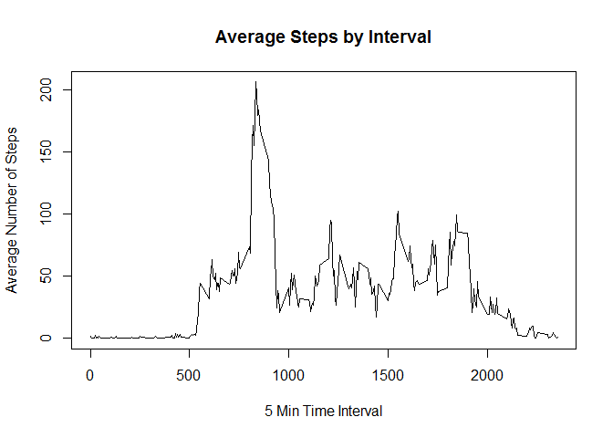

# Reproducible Research: Peer Assessment 1

## Data

This assignment makes use of data from a personal activity monitoring
device. This device collects data at 5 minute intervals through out the
day. The data consists of two months of data from an anonymous
individual collected during the months of October and November, 2012
and include the number of steps taken in 5 minute intervals each day.

The data for this assignment can be downloaded from the course web
site:

* Dataset: [Activity monitoring data](https://d396qusza40orc.cloudfront.net/repdata%2Fdata%2Factivity.zip) [52K]

The variables included in this dataset are:

* **steps**: Number of steps taking in a 5-minute interval (missing
    values are coded as `NA`)

* **date**: The date on which the measurement was taken in YYYY-MM-DD
    format

* **interval**: Identifier for the 5-minute interval in which
    measurement was taken

The dataset is stored in a comma-separated-value (CSV) file and there are a total of 17,568 observations in this dataset.


## Setting the stage

First, we will remove all variables from the environment and choose the POSIX locale.


```r
rm(list=ls(all=TRUE))
Sys.setlocale(category = "LC_ALL", locale = "C")
```


## Loading and preprocessing the data

Next, we load the data into a dataframe and inspect its overall structure.


```r
activity.df <- read.csv("activity.csv", header = TRUE)
```


```r
str(activity.df)
```

```
## 'data.frame':	17568 obs. of  3 variables:
##  $ steps   : int  NA NA NA NA NA NA NA NA NA NA ...
##  $ date    : Factor w/ 61 levels "2012-10-01","2012-10-02",..: 1 1 1 1 1 1 1 1 1 1 ...
##  $ interval: int  0 5 10 15 20 25 30 35 40 45 ...
```


## What is the mean total number of steps taken per day?

For this part of the assignment, we will ignore the missing values in
the dataset.

### Making a histogram of the total number of steps taken each day

We use the `dplyr` library to summarise the dataframe.


```r
library(dplyr)
```

```
## 
## Attaching package: 'dplyr'
## 
## The following objects are masked from 'package:stats':
## 
##     filter, lag
## 
## The following objects are masked from 'package:base':
## 
##     intersect, setdiff, setequal, union
```

```r
total.per.day <- summarise(group_by(activity.df, date),
                           steps = sum(steps, na.rm = TRUE))
hist(total.per.day$steps,
     breaks = 40,
     main = "Total Number of Steps per Day",
     xlab = "Steps per day")
```

 

### Calculating and report the **mean** and **median** total number of steps taken per day

We now calculate the **mean** and **median** over the total number of steps.


```r
mean.per.day <- round(mean(total.per.day$steps), 3)
median.per.day <- round(median(total.per.day$steps), 3)
```


```r
mean.per.day
```

```
## [1] 9354.23
```

```r
median.per.day
```

```
## [1] 10395
```

Then we supplement the histogram with the **mean** and **median** values.


```r
hist(total.per.day$steps,
     breaks = 40,
     main = "Total Number of Steps per Day",
     xlab = "Steps per day")

abline(v = mean.per.day, lwd = 3, col = "grey")
abline(v = median.per.day, lwd = 1, col = "grey")

legend("topright", lwd = c(3, 1), col = "grey",
       legend = c(paste("Mean: ", mean.per.day), 
                  paste("Median: ", median.per.day))
       )
```

 


## What is the average daily activity pattern?

### Making a time series plot of the 5-minute interval and the average number of steps taken, averaged across all days


```r
# summarize dataset by interval
activity.df.interv <- summarise(group_by(activity.df,
                                        interval),
                                avg_steps = mean(steps, na.rm = TRUE))

# make a time series plot
with(activity.df.interv, {
        plot(interval, avg_steps, type = "l",
             main = "Average Steps by Interval",
             xlab = "5 Min Time Interval",
             ylab = "Average Number of Steps")
        })
```

 

### Finding which 5-minute interval, on average across all the days in the dataset, contains the maximum number of steps


```r
# which interval has the maximum average steps
max_steps <- activity.df.interv[which.max(activity.df.interv$avg_steps), ]

with(activity.df.interv, {
        plot(interval, avg_steps, type = "l",
             main = "Average Steps by Interval",
             xlab = "5 Min Time Interval",
             ylab = "Average Number of Steps")
        })

# add an additional point to the plot
points(max_steps$interval,  max_steps$avg_steps,
       col = "red", lwd = 3, pch = 19)
```

 


## Imputing missing values

### Calculating the total number of missing values in the dataset


```r
sum(is.na(activity.df$steps))
```

```
## [1] 2304
```

### Devising a strategy for filling in all of the missing values in the dataset

For simplicity's sake, we choose to fill in all the missing values with the mean for each day.

### Creating a new dataset that is equal to the original dataset but with the missing data filled in


```r
# calculate the mean on a daily basis, removing NA values
mean.per.interv <- summarise(group_by(activity.df, interval),
                             mean = mean(steps, na.rm = TRUE))
mean.per.interv[is.na(mean.per.interv)] <- 0

# substitute NA values with the mean
activity.df.wo.na <- inner_join(activity.df, mean.per.interv,
                                by = "interval")
rpl.na <- function(x, y){ if(is.na(x)) return(y) else return(x) }
activity.df.wo.na$steps <- mapply(rpl.na,
                                  activity.df.wo.na$steps,
                                  activity.df.wo.na$mean)

# normalise the data set
activity.df.wo.na <- subset(activity.df.wo.na, select = -mean)
```

### Making a histogram of the total number of steps taken each day and calculating and reporting the **mean** and **median** total number of steps taken per day


```r
total.per.day.wo.na <- summarise(group_by(activity.df.wo.na, date),
                                 steps = sum(steps))
mean.per.day.wo.na <- round(mean(total.per.day.wo.na$steps), 3)
median.per.day.wo.na <- round(median(total.per.day.wo.na$steps), 3)

hist(total.per.day.wo.na$steps,
     breaks = 40,
     main = "Total Number of Steps per Day with NA removed",
     xlab = "Steps per day")

abline(v = mean.per.day.wo.na, lwd = 3, col = "grey")
abline(v = median.per.day.wo.na, lwd = 1, col = "grey")

legend("topright", lwd = c(3, 1), col = "grey",
       legend = c(paste("Mean: ", mean.per.day.wo.na), 
                  paste("Median: ", median.per.day.wo.na))
       )
```

 

### Do the values differ from the estimates from the first part of the assignment?

After replacing missing values with the mean per interval, the mean and the median are now pretty much the same.


## Are there differences in activity patterns between weekdays and weekends?

### Creating a new factor variable in the dataset with two levels


```r
# add a new factor column "daytype"
activity.df.wo.na$daytype <- ifelse(
        weekdays(
                as.Date(activity.df.wo.na$date)) %in% c("Saturday", "Sunday"),
        "Weekend",
        "Weekday")
activity.df.wo.na$daytype <- as.factor(activity.df.wo.na$daytype)

# calculate the mean over the number of steps, grouped by interval & daytype
activity.df.wo.na <- summarise(group_by(activity.df.wo.na,
                                        interval, daytype),
                               avg_steps = mean(steps, na.rm = TRUE))
```

### Making a panel plot containing a time series plot of the 5-minute interval and the average number of steps taken


```r
# load the lattice library
library(lattice)

# create a new plot
xyplot(avg_steps ~ interval | daytype,
       data = activity.df.wo.na,
       type = "l",
       xlab = "Interval",
       ylab = "Number of Steps",
       layout = c(1, 2))
```

 

During weekdays, the frequency of the steps exibits a much more defined "shape".  This might to be related to a less flexible daily schedule.
